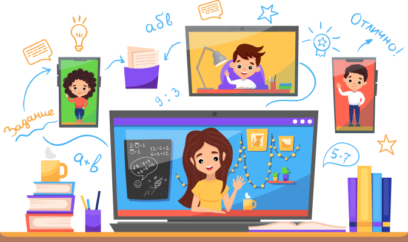
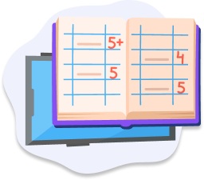

<!DOCTYPE html>
<html lang="ru">
<head>
    <meta charset="UTF-8">
    <meta name="viewport" content="width=device-width, initial-scale=1.0">
    <title>Школа</title>

    

    <link rel="preconnect" href="https://fonts.googleapis.com">
    <link rel="preconnect" href="https://fonts.gstatic.com" crossorigin>
    <link href="https://fonts.googleapis.com/css2?family=Open+Sans:ital,wght@0,400;0,700;1,500&display=swap" rel="stylesheet">

    <link rel="shortcut icon" href="">
    <link rel="stylesheet" href="./css/style.css">
    <link
    rel="stylesheet"
    href="https://cdnjs.cloudflare.com/ajax/libs/animate.css/4.1.1/animate.min.css"
  />
  <link href="https://cdn.jsdelivr.net/npm/bootstrap@5.3.3/dist/css/bootstrap.min.css" rel="stylesheet" integrity="sha384-QWTKZyjpPEjISv5WaRU9OFeRpok6YctnYmDr5pNlyT2bRjXh0JMhjY6hW+ALEwIH" crossorigin="anonymous">
    
</head>
<body>
    

        

            

            

                
            

            

                <a class="nav-item" href="#">Для кого</a>
                <a class="nav-item" href="">Как проходят уроки</a>
                <a class="nav-item" href="">Преимущества</a>
                <a class="nav-item" href="">Цены</a>
                <a class="nav-item" href="">Контакты</a>
                <a class="nav-item-num" href="">+7(707)-433-34-75</a>
            

           
            

                <a class="buton1" href="#" >ЗАПИСАТЬСЯ НА УРОК </a>
            

            

            <input id="menu-toggle" type="checkbox">
            <label for="menu-toggle">
                
                
                
            </label>
            <ul class="menu">
                <li><a href="#">Для кого</a></li>
                <li><a href="#">Как проходят уроки</a></li>
                <li><a href="#">Преимущества</a></li>
                 <li><a href="#">Цены</a></li>
                <li><a href="#">Контакты</a></li>
            </ul>
            

            

            

                

                    

                        Настоящая школа 
                        у вас дома! 
                    

                    

                        Мы даем детям реальные знания, потому наши классы не  
                        превышают 10 человек. А интерактивность и  
                        вовлеченность делает уроки интересными для детей. 
                    

                    

                        Семейное образование с нами - это эффективно!
                    

                    

                        <a href="#" class="header-buton">Записаться на урок</a>
                    

                    
                

                

                    
                

            

        

    

    

        

            

                

                    Кому подходит онлайн образование?
                

                

                    

                        

                            

                                
                            

                            

                                

                                    Для тех, кто хочет  
                                    получать знания
                                

                            

                        

    
                        

                            

                                
                            

                            

                                

                                          Для  
                                    путешественников
                                

                            

                        

    
                        

                            

                                
                            

                            

                                

                                    Для семейного  
                                    обучения
                                

                            

                        

                    

    
                    

    
                        

                            

                                
                            

                            

                                

                                    Для  
                                    спортсменов
                                

                            

                        

    
                        

                            

                                
                            

                            

                                

                                    Для проживающих  
                                    за рубежом
                                

                            

                        

                    

                

                
            

            

                

                    
                

                

                

                    Первый месяц обучения от 5 250 руб
                

                

                    Не знаете подойдет ли вашему ребенку обучение онлайн?  
                    Попробуйте первый месяц со скидкой 50%!
                

                

            

        

    

    

        

            

                
 
                    Как проходят уроки в нашей онлайн школе?
                

                    

                        

                            

                                
                            

                            

                                
                                    Дополнительные материалы
                                  
                                Материалы по каждой теме без лишней воды  
                                помогут закрепить знания
                            

                        

                        
                        

                            

                                
                            

                            

                                
                                    Проверка и оценка
                                  
                                Все домашние задания  
                                проверяются учителем и  
                                выставляется оценка в дневник
                            

                        

                    

                    

                        
                        

                            

                                
                            

                            

                                
                                    Живые уроки с учителем
                                  
                                Увлекательные уроки с учителем,  
                                на которых каждому ребенку будет  
                                уделено внимание 
                            

                            
                        

                        
                        

                            

                                
                            

                            

                                
                                    Домашнее задание
                                  
                                Для закрепления всего ранее  
                                полученного материала дети  
                                получают домашнее задание 
                            

                        

                       
                    

            

        

    

    

        

            

                Дети любят наши уроки потому что:
            

        

            

                

                    

                        
                    

                    

                        

                            Продвинутая геймификация
                        

                        

                            Мы используем мини-игры чтобы увлечь ребенка в   
                            процесс решения задач и помочь усвоить материал в  
                            интересной форме
                        

                    

                

                

                    

                        
                    

                    

                        

                            Не зубрят и не переписывают учебники
                        

                        

                            Дети вовлечены в урок по средствам взаимодействия  
                            между собой и педагогом. Играют в тематические квизы.  
                            Смотрят видео и разбирают материал.
                        

                    

                

                

                    

                        
                    

                    

                        

                            Никакого стресса
                        

                        

                            В учебных классах поддерживается атмосфера дружбы и  
                            уважения. Никакого давления. Дети чувствуют себя  
                            комфортно
                        

                    

                

                
            

            

                
            

        

        

    

    

        

            

                Глянем сравнение:
            

            

                

                    

                        
                    

    
                    

                        

                            ОБЫЧНАЯ ШКОЛА
                        

                        

                            <ul>
                                <li>Число детей в классе  
                                    <b>от 25</b>
                                </li>
    
                                <li>Количество уроков  
                                    5-6 в день
                                </li>
    
                                <li>Дополнительные занятия  
                                    обязательно
                                </li>
    
                                <li>Индивидуальный подход  
                                    нет
                                </li>
    
                                <li>Гибкий график занятий  
                                    нет
                                </li>
    
                                <li>Собрать ребенка в школу  
                                    от 30 тыс. рублей
                                </li>
                                    
                            </ul>
                        

                    

                

                
                

                    

                        

                            ОНЛАЙН ШКОЛА
                        

                        

                            <ul>
                                <li>Число детей в классе  
                                    до 12
                                </li>
    
                                <li>Количество уроков  
                                    2-3 в день
                                </li>
    
                                <li>Дополнительные занятия  
                                    по желанию
                                </li>
    
                                <li>Индивидуальный подход  
                                    да
                                </li>
    
                                <li>Гибкий график занятий  
                                    да
                                </li>
    
                                <li>Собрать ребенка в школу  
                                    0 рублей
                                </li>
                                    
                            </ul>
                        

                    

    
                    

                        
                    

                

    
            

        

    

    

        

             
            

                Онлайн школа   
                среднего образования это 
            

            

                

                    

                        
                    

                    

                        Удобный график занятий
                    

                    

                        Вы можете выбрать удобное время  
                        начала занятий (9:00, 11:00 или 13:00)
                    

                

                

                    

                        
                    

                    

                        Записи уроков доступны всегда
                    

                    

                        Пропустил урок - не страшно!  
                        Записи уроков можно посмотреть в   
                        любое время
                    

                

                

                    

                        
                    

                    

                        Сбалансированная нагрузка
                    

                    

                        Никаких лишних и не нужных занятий.   
                        Только важное и необходимое
                    

                

            

            

                

                    

                        
                    

                    

                        Не нужно покупать   
                        школьную форму и канцелярию
                    

                    

                        Тетрадка, ручка, линейка и карандаш -  
                        это все, что нужно для  
                        учебы в онлайн школе!  
                    

                

                

                    

                        
                    

                    

                        Высококлассные педагоги
                    

                    

                        Опытные учителя прошедшие   
                        строгий отбор и использующие с  
                        овременные методы обучения
                    

                

                

                    

                        
                    

                    

                        Никакого стресса
                    

                    

                        В учебных классах поддерживается  
                        атмосфера дружбы и уважения. Никакого давления  
                        Дети чувствуют себя комфортно  
                    

                

            

            

                

                    
                

                

                

                    Первый месяц обучения от 5 250 руб
                

                

                    Не знаете подойдет ли вашему ребенку обучение онлайн? 
                    Попробуйте первый месяц со скидкой 50%!
                

                

                
            

        

    

    

        

            

                Сколько стоит обучение в онлайн школе?
            

            

                

                            

                                10 500 ₽ /мес
                            

                            

                                

                                    1-4 класс
                                

                                

                                    Веселые и увлекательные  
                                    уроки
                                

                                

                                    
                                    

                                        

                                            
                                        

                                        

                                            2-3 урока в день пн-чт
                                        

                                    

                                    

                                        

                                            
                                        

                                        

                                            10-12 учеников в классе
                                        

                                    

                                    

                                        

                                            
                                        

                                        

                                            внимание к каждому ребенку
                                        

                                    

                                    

                                        

                                            
                                        

                                        

                                            интерактивные  
                                            тренажеры
                                        

                                    

                                    

                                        

                                            
                                        

                                        

                                            игровая форма   
                                            обучения
                                        

                                    

                                    

                                        

                                            
                                        

                                        

                                            зачисление в школу   
                                            партнер 12 000/год
                                        

                                    

                                

                        
                                    

                                        <a href="#" class="mani-buton">Подробнее</a>
                                    

                                    

                            

                

                

                    

                        10 500 ₽ /мес
                    

                    

                        

                            1-4 класс
                        

                        

                            Веселые и увлекательные  
                            уроки
                        

                        

                            
                            

                                

                                    
                                

                                

                                    2-3 урока в день пн-чт
                                

                            

                            

                                

                                    
                                

                                

                                    10-12 учеников в классе
                                

                            

                            

                                

                                    
                                

                                

                                    внимание к каждому ребенку
                                

                            

                            

                                

                                    
                                

                                

                                    интерактивные  
                                    тренажеры
                                

                            

                            

                                

                                    
                                

                                

                                    игровая форма   
                                    обучения
                                

                            

                            

                                

                                    
                                

                                

                                    зачисление в школу   
                                    партнер 12 000/год
                                

                            

                        

                
                            

                                <a href="#" class="mani-buton">Подробнее</a>
                            

                            

                    

        

        

            

                10 500 ₽ /мес
            

            

                

                    1-4 класс
                

                

                    Веселые и увлекательные  
                    уроки
                

                

                    
                    

                        

                            
                        

                        

                            2-3 урока в день пн-чт
                        

                    

                    

                        

                            
                        

                        

                            10-12 учеников в классе
                        

                    

                    

                        

                            
                        

                        

                            внимание к каждому ребенку
                        

                    

                    

                        

                            
                        

                        

                            интерактивные  
                            тренажеры
                        

                    

                    

                        

                            
                        

                        

                            игровая форма   
                            обучения
                        

                    

                    

                        

                            
                        

                        

                            зачисление в школу   
                            партнер 12 000/год
                        

                    

                

        
                    

                        <a href="#" class="mani-buton">Подробнее</a>
                    

                    

            

            

        

    

    

    

        

            

                

                    

                        Все еще  сомневаетесь?
                    

                    

                        Всегда страшно переходить на что-то новое и  
                        неизведанное, потому мы предоставляем нашим  
                        клиентам возможность попробовать обучаться  
                        первую неделю абсолютно бесплатно.  
                    

                    

                        
                    

                    
                

                

                    <form  action="#" class="form">
                            <label for="class">Класс:</label>
                            <input type="text" id="class" name="class" required>
                    
                            <label for="parentName">Имя родителя:</label>
                            <input type="text" id="parentName" name="parentName" required>
                    
                            <label for="phoneNumber">Номер телефона:</label>
                            <input type="tel" id="phoneNumber" name="phoneNumber" required pattern="[0-9]{10}">
                    
                            <button class="btnform" type="submit">Оставить заявку</button>
                            
Нажимая кнопку вы даете   
                                согласие на обработку данных

                    </form>
                

            

        

    

    
    

        

            

                

                    

                        
                    

        
                    

                        

                            Соцсети
                        

                        

                            

                                
                            

                            

                                
                            

                            

                                
                            

                        

                    

    
                    

                        

                            
                        

                       

                        

                            +7 707 433 34 75
                        

                    

    
                

            

            

                © Э_R_A  Cоглашение на обработку ПД
            

        

    

    
    
    
</body>
</html>
